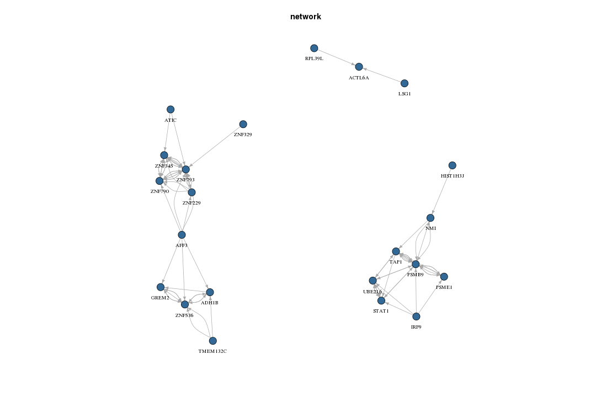

# OmicsARules
tool for the analysis of multimodal high-throughput data


## Introduction
OmicsARules is a tool for the analysis of multimodal high-throughput data based on the use of association rules. OmicsARules supports to identify recurrent and associated patterns, and provides a new dimension for exploring single or multiple omics data across sequencing platforms or across samples. Association rule mining and visualizing were implemented in R environment using package arules and ggplot2.

## Frequent itemsets and assoication rule

In data mining field, the frequently co-occurring items are called frequent item sets and their associated relationship is named assoication rule. Originated from market basket data analysis, association rules is a popular and well researched method for discovering strong relationship exists between two frequent items[4].

Let I = {i 1 , i 2 , . . . , i n } be a set of n binary attributes called items. Let D = {t 1 , t 2 , . . . , t m } be a set of transactions called the database. Each transaction in D has an unique transaction ID and contains a subset of the items in I. A rule is defined as an implication of the form X -> Y where X, Y ⊆ I and X ∩ Y = ∅. The sets of items (for short itemsets) X and Y are called antecedent (left-hand-side or LHS) and consequent (right-hand-side or RHS) of the rule.

To illustrate the concepts, we use a small example from the supermarket domain. The set of items is I = {milk, bread, butter, beer} and a small database containing the items is shown below. An example rule for the supermarket could be {milk, bread} -> {butter} meaning that if milk and bread is bought, customers also buy butter.

```
transaction_ID items 
1 milk,bread 
2 bread,butter 
3 beer 
4 milk,bread,butter 
5 bread,butter 

```
An example supermarket database with five transactions.

In the case of omics data, items usually refer to genes. So frequent items refer to genes in which mutations, methylation and differentially expressed events occur more frequently than expected by random chance. Importantly, the co-occurrence pattern among significantly mutated genes, hyper- and hypo-methlylated genes or differentially expressed genes often imply potential mechanistic connections. Therefore, the associated pattern among them can be identifed by association rules with Apriori algorithm. 

## What is Apriori?

Apriori is an algorithm for frequent item set mining and association rule learning over transactional databases. It proceeds by identifying the frequent individual items in the database and extending them to larger and larger item sets as long as those item sets appear sufficiently often in the database. The frequent item sets determined by Apriori can be used to determine association rules which highlight general trends in the database. 

## What is support?

To select interesting rules from the set of all possible rules, constraints on various measures of significance and interest can be used. The best-known constraints are minimum thresholds on support and confidence.Support of an itemset X is defined as the proportion of transactions in the data set which contain the itemset. For example, in Table 1, the itemset {milk, bread} has a support of 2/5=0.4 since it occures in 40% of all transactions(2 out of 5 transactions). In the omics data, this "support" measure indicates the proportion of patients'samples in the dataset which contained the "changed" genes. 

## What is confidence? 

Confidence of a rule is defined as conf(X -> Y ) = supp(X ∪ Y )/supp(X). Confidence can be interpreted as an estimate of the probability P (Y |X), the probability of finding the RHS of the rule in transactions under the condition that these transactions also contain the LHS. For example, the rule {milk, bread} -> {butter} has a confidence of 0.2/0.4 = 0.5 in the database in Table 1, which means that for 50% of the transactions containing milk and bread the rule is correct. In the omics data, the 'confidence' measure indicates that, in all the patients with the 'changed' pattern of gene set X, the proportion of patients accompany the 'changed' gene Y in the form of rule {X -> Y}. 

## What is lift? 

Lift is another practical solution to narrow down the number of rules, in the situation of too many association rules found satisfying the support and confidence constraints. The lift of a rule is defined as lift(X -> Y ) = supp(X ∪ Y )/(supp(X)supp(Y )), and can be interpreted as the deviation of the support of the whole rule from the support expected under independence given the supports of the LHS and the RHS. For example, in Figure 1, the rule {milk, bread} -> {butter} has a lift of 0.2/(0.2.2/le = 1.67 in the database in Table 1, which means that the realistic occurrence rate of this rule is 1.67 times more than the co-occurrence rate calculated under independence. In the omics data, lift measure indicated the possibility of co-occurrence between gene or gene set X and gene Y in the form of rule{X -> Y}. 

## What is number of gene?

You can select n top-ranked gene and use these genes to have process run, you are required to sort these genes according to a certain score, which measure the importance of genes to cancers. The score could be P value, t statistic or AUC value after differentially expression analysis or diagnostic test. As for mutation dataset, genes could be ranked according to the mutation rate of each gene. 

## What is maxlen and minlen?

Maxlen means the maximum size of the rule, and minlen means the minimum size of the rule, that is LHS plus RHS. 

## What is lamda?

Lamda is a new measure to indicates the significance and interest of rules. This measure not only use binary data, but also continuous variables to overcome the shortcoming of loss of information that other association rules mining algorithms(ARM) used to have.


## Data discretization

The uploading data is preferable to be a binary dataset containing interested genes. Alternatively, if the input dataset contains continuous variable, users should firstly identify the interesting genes according to their own measures. For example, for mRNA profiling data, the genes can be selected and sorted by P values from differential expression analysis. OmicsARules provides four cutoff values to discretize the continuous values into binary matrix, namely mean, median, P25 (the upper quartile), P75 (the lower quartile). OmicsARules calculates one of these cutoff values (according to the user's choice) in each column, and if the values in each gene of a particular sample larger than the cutoff value, this value would be transformed into 1, otherwise, 0 is used. 

## Result example

This association rules analysis was performed on ESCA mRNA expression (support=0.4 and confidence=0.8). The dataset contains 184 patients and the top-2000 DEGs. Interestingly, some well-known relationships between genes were observed. For instance, a particular rule {CDK1}==>{CCNB2} was identified with support 0.435, confidence 0.808 and lift 1.416. From biological viewpoint, this rule means co-occurrence of CDK1 and CCNB2 dysregulation in mRNA expression happened on more than 40% ESCA patients [the actual frequency: supp(CDK1 ∪ CCNB2 )=43.5%]. In view of confidence, when CDK1 was dysregulated, the possibility of simultaneously altered CCNB2 expression was 80.8% [supp(CDK1)=99/184=53.8%; supp(CDK1 ∪ CCNB2)==80/184=43.5%; supp(CDK1 ∪ CCNB2 )/supp(CDK1)=80.8%]. As for another measure lift, compared to possibility of random events, that is, dysregulation of CDK1 was independent of CCNB1 [supp(CDK1)=53.8%; supp(CCNB2)=105/184=57.1%; supp(CDK1)×supp(CCNB2)=30.7%], their co-dysregulation was 1.416 times more frequent [supp(CDK1 ∪ CCNB2)/(supp(CDK1) ×upp(CCCNB2))=1.416].

```
 lhs rhs support confidence lift lamda 
1 {ZNF329} {ZNF793} 0.347 0.82 1.65 11.49  
2 {TAP1} {PSMB9} 0.413 0.883 1.711 21.445  
3 {PSMB9} {TAP1} 0.413 0.8 1.711 14.723  
4 {PSME1} {PSMB9} 0.402 0.831 1.61 9.263  
5 {ZNF345} {ZNF790} 0.385 0.855 1.873 41.334  
```

## Mining association rule conserved across multiple omics datasets

One merit of OmicsARules is easy to find "conserved" rules across different platforms or different cancers. First, the user should upload two datasets, and select the parameters just as mining association rules from a single dataset. Second, after a plentiful association rules were produced, the server will automatically identify the "conserved" rules across platforms or cancers depending on the upload datasets and the analysis purposes. There is an exmaple result of common rules is demonstrated below. 

```
LHS    RHS 
HOXC8, ULBP2     =>     HOXC13    
C1orf135, C6     =>     HOXC13    
GRK7, HOXC13     =>     CDH3    
ULBP2, HOXC13     =>     CDH3    
TENC1, ZBTB47     =>     HSPB6    
TENC1, CHRDL1     =>     HSPB6    
C6, TENC1     =>     HSPB6  
```
An example of the common rules.

## Group based demonstration 

To visualize the grouped matrix, a balloon plot was created with antecedent groups as columns (LHS) and consequents as rows (RHS). The idea is that genes on the left side of several rules, which are statistically dependent on the same gene on the right side, are supposed to be similar and thus can be grouped together. We start with the set of association rules: R = { a1 , c1 , m1 , . . . ai , ci , mi , . . . an , cn , mn }, where ai is the gene or gene set on the LHS, ci is the gene on the RHS and mi is the selected interest measure (default: lift) for the i-th rule for i = 1, . . . , n. Consequently, a L × K matrix M in R with one column for each unique antecedent and one row for each unique consequent was identified and created. The color of balloons represent the lift of rules and the size of balloons represent the support of rules. For instance, one of column names, '3 rules: {HS3ST4, KCNMB1}', indicated that this particular rule with either one or two genes on the LHS was appeared in 3 rules, with three different genes on the RHS (namely SYNPO2, LMOD1 and MYH11). 


Group plot of association rules

## Graph based demonstration  
This method visualizes association rules using vertices typically represent genes or gene sets and edges indicate their relationship in rules.


Graph plot of association rules


----------------------------
# License
----------------------------

TGStools is released under the MIT license.

